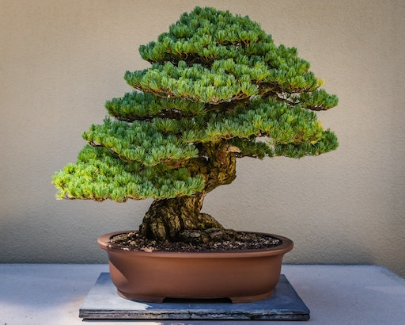

# DockerBonsai

</img>

The Bonsai is by [Davin H](https://unsplash.com/@devin_photography) from unsplash.

## Usage

`cd {dir}` then, run make command.

```
make br
```

## Environments

- C++ base
- C++ + TensorFlow-2.3.1-GPU
- Python 3.7
- Python 3.7 + TensorFlow-2.3.1-CPU
- Python 3.7 + TensorFlow-2.3.1-GPU
- Python 3.7 + PyTorch-1.7.1
- jupyter notebook/lab
- ubuntu-base
- (WIP) Flutter-base
- (WIP) Vue-js base

## TODO-list

- DeepLearning AMI-modoki (with various CUDA)
- flutter: (WIP)
  - [ ] X11 Forwarding
  - [ ] Android Studio
  - [ ] iOS Simulator
  - [ ] run sample
- VUE.js
- Blender with X11
- Unity with X11
- ShaderLang: Cg, HLSL or GLSL (ShaderLab)
- Docker Compose
- Docker installer (check with any env)